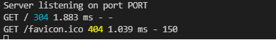

1. 셋팅 
- package.json : 프로젝트에 대한 기본 명세서. 모듈, 애플리케이션, 확장 모듈 정보를 담고 있으며, npm으로 생성 가능
                 명령어 npm init로 자동 생성 [상세](https://edu.goorm.io/learn/lecture/557/%ED%95%9C-%EB%88%88%EC%97%90-%EB%81%9D%EB%82%B4%EB%8A%94-node-js/lesson/174371/package-json)

                 package.json만 있어도 npm기능 때문에 패키지를 알아서 설치(필수) >> .gitignore에 node_module에 넣어도 package.json이 있기 때문에 모듈 폴더를 다 올릴 필요 X

                 main : 배포한 package를 다른 사람들이 설치하면 main으로 사용 

                 scripts : 실행하고 싶은 파일을 지정 >> 실행 : npm run win(key명) 단, 프로젝트 폴더 안에서 실행해야만 함

                 dependencies : 프로젝트에 필요한 모듈을 명시

                 devDependencies : 개발자에 필요한 모듈. 없어도 되나, 모듈을 추가할 시 개발할 때 편리함 

※ [VSC_git_bash_설정](https://velog.io/@westkite/vscode-%ED%84%B0%EB%AF%B8%EB%84%90-Git-bash-%EC%84%A4%EC%A0%95)

※ [VSC_git_bash_추가](https://notstop.co.kr/401/)
- 패키지 설치 : npm i/install package 예) npm i express 

               package.json에 dependencies를 알아서 추가하고, 만약에 dependencies에 명시해도 npm이 알아서 설치 

               package.json을 닫거나 저장하고 나서 실행** >> package.json을 저장하지 않고 install하면 버전 충돌 
- express : nodejs 웹 프레임 워크 [상세](https://developer.mozilla.org/ko/docs/Learn/Server-side/Express_Nodejs/Introduction)

            설치 후 사용방법 : main에 import express from "express"; // == const express = require("express"); 임포트 
※ npm은 체인처럼 연결된 dependencies를 해석해서 모든 폴더들을 다운 [상세](https://web-front-end.tistory.com/3)
- package-lock.json : 패키지를 안전하게 관리 
- babel : nodejs가 최신의 자바스크립트를 문제없이 이해하도록 변환 >> babel.config.json에 있는 내용을 보고 자동으로 변환 

          preset : 바벨을 위한 엄청 거대한 플러그인. preset-env가 유명하며 react, typescirpt용도 있음 

          [설치및환경설정](https://babeljs.io/setup#installation)
※ dependencies를 다르게 설정되어 있다고 하더라도 모든 건 node_modules 폴더에 저장되며 package.json은 텍스트파일이므로 수정 가능  
- nodemon : 파일이 수정되는 걸 감시해주는 패키지 >> 일일이 수정할때마다 npm run ~ 파일 실행할 필요 X 
            [설치](https://babeljs.io/setup#installation)
2. express [상세](https://expressjs.com/ko/4x/api.html#app)
- 객체 사용 시, 상단에 import 처리 필수(node_modules(dir)에서 express를 찾아서 import) 예) import express from "express" 
- **application** 사용할 때는 객체 선언 예) const app = express(); 
- 객체 선언 후에 서버 실행 예) app.listen(포트, 콜백) == addEventListener 확인 : localhost:4000 
- Request : 사이트 접속, 버튼 클릭과 같은 사용자(브라우저)에게 오는 http request.

            response를 하지 않으면 브라우저가 무한 루프(cannot get /) 예) app.get("/", handleHome); >> handleHome에서 req에 대한 res 처리 
- Response : 해당 URI의 request에 대한 처리. 
            
             예) ``` const handleHome = (req, res) => {
                    return res.send("ddd"); // res.end()로도 가능. res.end() : kill 
                }; ``` >> req, res object를 express에서 보내주는데 이 안에는 많은 정보들이 담겨져 있음 
- Middleware : 작업을 다음 함수에게 넘기는 함수로, 응답하는 함수 X >> req, res 사이에 있음

               대부분 마지막으로 호출되는 함수가 return >> 무조건 마지막 함수가 return이 되는 것이 아니고 중간에 다른 함수가 return할 수 있음. 그럴 경우에는 그 다음 함수 실행 X (response 해줄때까지는 모든 controller가 middleware) 

               모든 controller(==handler)가 middleware가 될 수 있으며, req, res, next 인자값을 가지고 있음(next 인자 생략 가능) >> 관습적으로 마지막 contrller는 netx 인자 생략. 중간 middleware은 꼭 순서대로 인자 입력

               next() : 다음 함수 호출 예) app.get("/login", handleMiddle, handleLogin); >> handleMiddle : Middleware, handleLogin : 마지막 함수
               
               ```  
               const handleMiddle = (req, res, next) =>{
                    console.log(`${req.method} ${req.url}`);
                    next(); // 다음 함수 호출 
                };
                ```

               app.use() : global middleware 예) app.use(logger); app.use(handleMiddle); >> 모든 route가 app.use를 거침 

                           app.use() 보다 먼저 선언하면, 먼저 실행되므로 순서 **중요** >> global을 먼저 실행하려면 먼저 선언 

               morgan : extral middleware 모듈로, request logger middleware [상세](https://www.npmjs.com/package/morgan)

                        직접 global middleware 하는 것처럼 차이가 없고 기능 동일. 단순히 http request에 대한 정보가 깔끔하게 나옴 
                        
                        

                        morgan 설치, import 후 사용 가능. 사용의 예) morgan("dev"); >> 속성(dev)에 따라 다양한 정보를 보여줌 

                        morgan도 next가 있기 때문에 middleware(해당 내용은 깃허브에서 확인 가능)    
※ 서버 역할 : request를 listen한 다음에 resposne >> 개발자가 response에 대한 구현
※ http request : 웹사이트에 접속하고 서버에 정보를 보내는 방법  
- Router : 컨트롤러와 url의 관리. >> 작업 중인 주제를 기반으로 url을 그룹으로 정리

           라우터 안에 라우터를 넣을 수 있음

           선언 : const gloalRouter = express.Router(); 

           사용 : app.use("/", globalRouter);  == express가 해당 경로로 접근해서 globalRouter에 있는 컨트롤러를 찾음 

                  server.js(main)에 모든 라우터를 지정하는 것보다는 라우터용 폴더를 따로 만들어서 관리하는 것이 편리함(위치 : ./src/routes/경로별_라우터.js)
                  
                  각 라우터 별로 라우터 경로를 정의하며, 각 파일마다 독립적으로 운영되고 있기 때문에 필요한 모듈은 항상 import처리 >> 이미 다른 파일에서 import했더라도 다시 import

                  export하기 전에는 각 파일들은 private상태이기 때문에 파일의 내용을 공유하기 위해서는 **export 먼저 처리** 

                  export 처리 : export default 변수(한개만 가능) or export const 변수s(여러개 export 가능)

                  예) export default gloalRouter;

                      import globalRouter from "./routers/globalRouter";  // 변수명을 원하는 대롤 지정 가능

                      export const trending = (req, res) => res.send("Home Page Videos"); 

                      export const search = (req, res) => res.send("Search"); 

                      import {trending, search} from "../controllers/videoConroller";  //export하는 변수명과 동일하게, object 형태로 지정

            파라미터 사용 : ":변수명" 이용. 예) videoRouter.get("/:id(\\d+)", see);  //숫자만 허용

                           만약에 숫자만 가능하고 나머지는 불가능할 경우, 정규식으로 제한 가능 >> 제한을 하지 않으면 숫자 외 나머지 것들도 접근 가능 예) /upload 
※ 컨트롤러 : 함수, 라우터 : 그 함수를 단순히 이용하므로 라우터와 컨트롤러 섞여 쓰지 않는 것이 나음 
※ ./ : 현재위치, ../ : 상위 폴더로 이동

- mysql 패키지 : [상세](https://darrengwon.tistory.com/688)
- 트랜잭션 : [상세](https://www.npmjs.com/package/mysql#transactions)
- mysql 다중 처리 : [상세](https://junspapa-itdev.tistory.com/10) 
