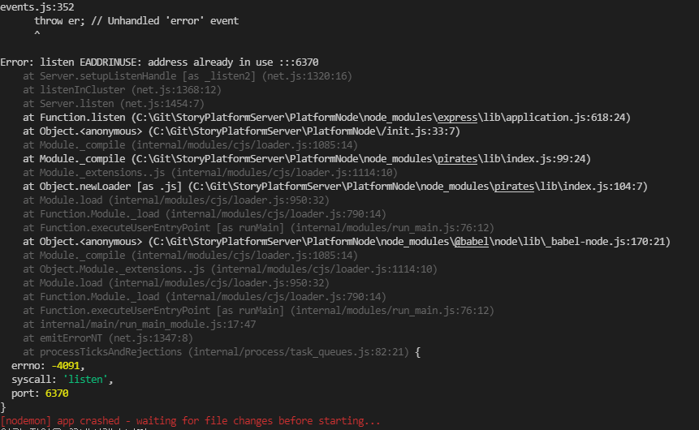

1. 포트 충돌 오류 

원인 : 동일 포트로 인하여 발생
해결 : 해당 포트 kill 

       Windows) 프로세스 확인하기 : netstat /o -na 

                해당 PID 프로세스 이름 확인하기 : tasklist /fi "pid eq [포트번호]" 

                프로세스 강제 종료하기 : taskkill /f /pid [포트번호]

                관련 내용 [참조1](https://life-it.tistory.com/42)

                          [참조2](https://byounghee.tistory.com/191)

                          [참조3](https://asiatica-aramid.tistory.com/30)
